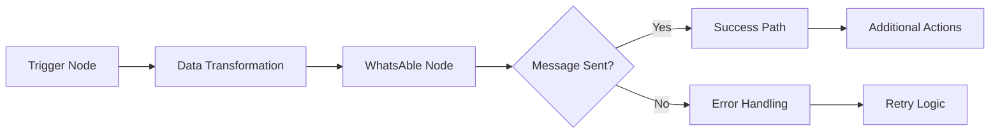

# WhatsAble Integration with n8n

<Frame caption="Automate your WhatsApp messaging workflows with n8n and WhatsAble">
  
</Frame>

<Info>
  WhatsAble lets you automate WhatsApp messaging through your favorite workflow automation platforms. This guide walks you through connecting WhatsAble with n8n to create powerful WhatsApp messaging workflows.
</Info>

## Prerequisites

Before getting started, make sure you have:

<CardGroup cols={2}>
  <Card title="WhatsAble Account" icon="user">
    An active subscription with WhatsAble
  </Card>
  <Card title="n8n Account" icon="user">
    Access to [n8n](https://app.n8n.cloud/login) workflow automation platform
  </Card>
</CardGroup>

<Tip>
  New to WhatsAble? [Sign up here](https://dashboard.whatsable.app/signin)
</Tip>

## Get started with WhatsAble

<Steps>
  <Step title="Subscribe to WhatsAble">
    To use the WhatsAble API, you'll need an active subscription:
    
    1. Log in to your WhatsAble dashboard
    2. Click the **Subscribe** button
    3. Start your 7-day free trial
    
    <Tip>
      During your trial, you can add unlimited phone numbers to test the service. After the trial period, pricing is $8.99 per month per phone number.
    </Tip>
  </Step>
  
  <Step title="Add and verify your phone number">
    For WhatsAble to send messages through your WhatsApp account:
    
    1. In your WhatsAble dashboard, navigate to **Verified Numbers**
    2. Click **Add New Number**
    3. Enter your phone number (with country code)
    4. You'll receive a WhatsApp verification code
    5. Enter the verification code in the WhatsAble dashboard
    
    <Frame caption="Adding and verifying a phone number">
      
    </Frame>
    
    <Note>
      **Multiple numbers?** You only need to complete the verification process for your first phone number. For additional numbers, simply add them and save—no verification required.
    </Note>
  </Step>
  
  <Step title="Get your API key">
    To connect WhatsAble with n8n, you'll need your API key:
    
    1. In your WhatsAble dashboard, go to **API Keys**
    2. Copy your unique API key
    3. Store it securely—you'll need it for the integration

    <Warning>
      Never share your API key publicly or commit it to version control systems.
    </Warning>

    <Frame caption="API Key Location">
      
    </Frame>

  </Step>
</Steps>

## Connect WhatsAble to n8n

Now that you have WhatsAble set up, let's connect it to n8n to automate your workflows.

<Steps>
  <Step title="Set up your n8n workflow">
    1. Log in to your n8n account
    2. Create a new workflow by clicking **+ New Workflow**
    3. Add a trigger node of your choice:
       - Popular triggers include Google Forms, Jotform, ClickUp, or a Schedule trigger
       - Connect and configure your trigger according to your use case

<Accordion title="WhatsAble trigger node (optional)">
  <Info>
    The WhatsAble trigger node enables your workflow to respond automatically to incoming WhatsApp messages. This setup is optional but recommended for building reactive communication flows.
  </Info>

  <Steps>
    <Step title="Add WhatsAble trigger node">
      Follow these steps to add the WhatsAble trigger node to your workflow:

      1. Click the **+** button in your workflow canvas to add a new node
      2. Search for "WhatsAble" in the node library search bar
      3. Select the node displaying the official WhatsAble logo
      4. From the available trigger options, choose **On new Incoming message event**

      <Frame caption="Adding WhatsAble trigger node with 'On new Incoming message event' selection">
        
      </Frame>

      <Tip>
        The trigger node will automatically listen for incoming messages and initiate your workflow when a new message is received.
      </Tip>
    </Step>

    <Step title="Configure authentication credentials">
      Set up your WhatsAble API credentials to establish a secure connection:

      **Webhook URL Configuration:**
      1. In the WhatsAble Trigger node parameters, locate the **Webhook URLs** section at the top
      2. Select **Production URL** and copy the generated URL by clicking on it
      3. Store this URL securely as you'll need it for the credential setup

      <Frame caption="Copying the Production URL for webhook configuration">
        
      </Frame>

      **Credential Creation:**
      1. In the **Credential to connect with** dropdown, click **+ Create new credential**
      2. Select **WhatsAble Trigger API** as your connection method
      3. Enter your WhatsAble API key in the **API Key** field
      4. Paste the Production URL you copied earlier into the **Production URL** field
      5. Assign a descriptive name to your credential (e.g., "WhatsAble Production")
      6. Click **Save** to securely store your credentials

      <Frame caption="Credential configuration for WhatsAble Trigger node">
        
      </Frame>

      <Note>
        Your API credentials are encrypted and stored securely. Never share your API key publicly or commit it to version control.
      </Note>
    </Step>

    <Step title="Test and activate workflow">
      Complete the setup by testing and activating your trigger:

      **Response Configuration:**
      1. In the **Respond** dropdown, select your preferred response timing:
         - **Immediately**: Responds as soon as the trigger fires
         - **When Last Node Finishes**: Waits for the entire workflow to complete before responding

      **Testing:**
      1. Click **Execute step** on the WhatsAble node to run a test
      2. Verify the connection is working by checking for a success confirmation
      3. Review any error messages if the test fails and adjust your configuration accordingly

      <Check>
        Once activated, your workflow will automatically process incoming messages according to your configured logic.
      </Check>

      <Warning>
        Remember to test your workflow thoroughly before activating it in production to ensure it behaves as expected.
      </Warning>
    </Step>

  </Steps>
</Accordion>
  </Step>
  
  <Step title="Add the WhatsAble node">
    1. Click the **+** button to add a new node
    2. Search for "WhatsAble" in the node library
    3. Select the node with the official WhatsAble logo
    4. After selecting the WhatsAble node, choose 'Send message via whatsAble' from the available actions menu

    <Frame caption="WhatsAble node: Send message via WhatsAble action selection">
      
    </Frame>

  </Step>
  
  <Step title="Configure WhatsAble credentials">
    **Credential Setup:**
    1. In the WhatsAble node settings, find the **Credential to connect with** dropdown
    2. Select **+ Create new credential**
    3. Enter your WhatsAble API key that you copied earlier
    4. Name your credential (e.g., "WhatsAble Production")
    5. Click **Save** to store your credential
  </Step>
  
  <Step title="Configure your message">
    1. In **Resource** dropdown, select **Send Message**
    2. In the **Operation** dropdown, select **Send message via WhatsAble**
    3. Complete the required fields:
    
    <ResponseField name="Recipient Name or ID" type="string" required>
      Select the recipient's phone number (with country code) previously added in WhatsAble
    </ResponseField>
    
    <ResponseField name="Text" type="string" required>
      Type your message text or use variables from previous nodes
    </ResponseField>
    
    <Expandable title="Optional Parameters">
      <ResponseField name="Attachment URL" type="URL">
        Enter the URL of the file, image, or video you want to send with your message
      </ResponseField>
      
      <ResponseField name="File Name" type="string">
        Specify a custom filename for your attachment
      </ResponseField>
    </Expandable>
  </Step>
  
  <Step title="Test and activate your workflow">
    1. Click **Test Step** on the WhatsAble node to verify it's working correctly
    2. If the test is successful, you'll see a confirmation message
    3. Click **Done** to return to your workflow
    4. Click **Save** to save your entire workflow
    5. Toggle the **Active** switch in the top-right corner to activate your workflow
  </Step>
</Steps>

## Example use cases

<CardGroup cols={2}>
  <Card title="Customer Onboarding" icon="user-plus">
    Send a welcome message when a new customer signs up
  </Card>
  
  <Card title="Order Notifications" icon="box-check">
    Update customers when their order status changes
  </Card>
  
  <Card title="Appointment Reminders" icon="calendar">
    Automatically send reminders before scheduled appointments
  </Card>
  
  <Card title="Lead Follow-up" icon="user-check">
    Send personalized messages to new leads from your form submissions
  </Card>
  
  <Card title="Support Ticket Updates" icon="ticket">
    Notify customers when their support ticket status changes
  </Card>
</CardGroup>

## Workflow Diagram

**Sample WhatsAble n8n Workflow:**

## Troubleshooting

<AccordionGroup>
  <Accordion title="Message not being sent?" icon="circle-exclamation">
    **Steps to resolve:**
    
    1. **Verify Account Active:** Verify that your WhatsAble account is active.
    2. **Phone Number Verification:** Check that your phone number is properly verified.
    3. **API Key in n8n:** Ensure your API key is entered correctly in n8n.
    4. **Recipient Number Format:** Confirm that the recipient's phone number is in the correct format (including country code).
  </Accordion>
  
  <Accordion title="File attachments not working?" icon="file-exclamation">
    **Steps to resolve:**
    
    1. **File Size Limit:** Check that the file size is under 16 MB.
    2. **Supported File Type:** Verify the file type is supported by WhatsApp.
    3. **Accessibility:** Ensure the file path or URL is accessible.
  </Accordion>
</AccordionGroup>

## Need help?

Our support team is ready to assist you:

<CardGroup cols={3}>
  <Card title="Email support" icon="envelope" href="mailto:team@whatsable.app">
    Contact team@whatsable.app
  </Card>
  <Card title="Schedule a demo" icon="calendar" href="https://tidycal.com/axelmeta/whatsapp-notifications-by-whatsable">
    Book a personalized walkthrough
  </Card>
  <Card title="Live chat" icon="message-dots" href="https://dashboard.whatsable.app/signin">
    Click the chat button in the bottom right corner of the WhatsAble dashboard
  </Card>
</CardGroup>

<Info>
  For additional automation platform integrations (Make.com, Zapier, etc.), please contact our support team or check our integration documentation.
</Info>
